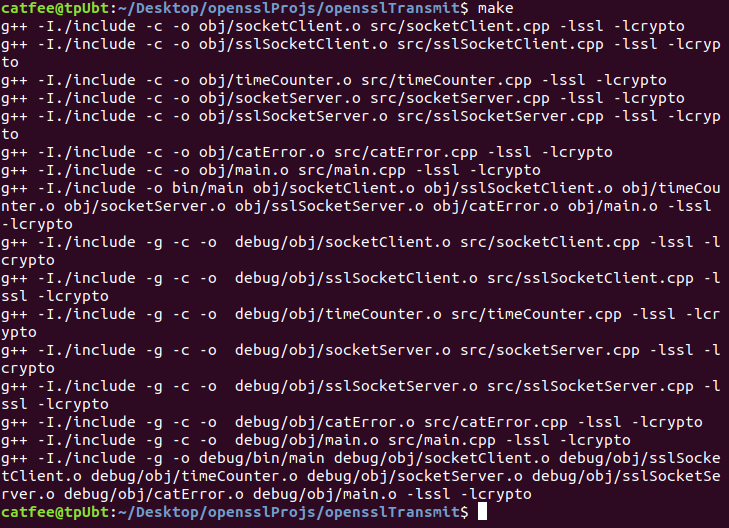
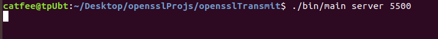
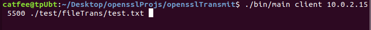
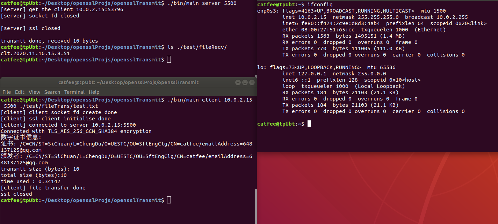

# opensslTransmit
## 基于openssl的加密文件传输软件

## ssl-console分支
在console版本基础上增加了ssl加密功能

### 目录结构
```
.
├── bin
├── certs
├── debug
│   ├── bin
│   └── obj
├── imgs
├── include
├── obj
├── src
└── test
    ├── fileRecv
    └── fileTrans
```
### 运行方法
1 下载源代码

`$ git clone https://github.com/ca1fee/opensslTransmit.git`

2 切换到ssl-console分支
`$ git checkout ssl-console`

3 make

`$make`



4 运行服务端程序

`$ ./bin/main server <监听端口> [ <接收文件名> ]`



5 运行客户端程序

`$ ./bin/main client <服务器ip> <服务器端口> <传输文件名>`



**即可在运行目录(或者指定的目录)找到传输的文件，格式为：clt.年.月.日.时.分.秒(或指定的目录和文件名)**


